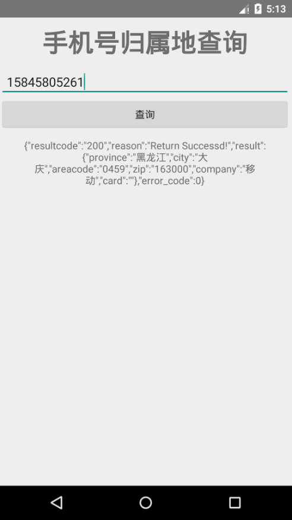

# StudentMgr

> 本项目的基础是来自于Android课程的第二次上机作业

## 主要内容包括

### LoginActivity

1. postDelayed（）延迟执行任务
2. InheritableThreadLocal<Object> 实现不同线程之间的通信

### MainActivity

1. ListView的Item数据及样式配置（引用了额外的XML样式文件）
2. SQlite数据库的连接以及使用
3. 为LIstView注册了上下文菜单事件

### StudentActivity

1. 二级Spinner联动的使用

### 通过第三方API查询手机号归属地

# 动态演示效果

